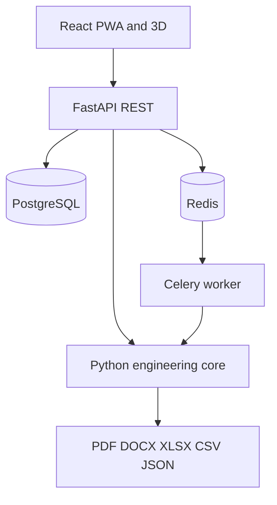

# Architecture

The engineering core has no dependency on FastAPI, React, PostgreSQL or Redis.
The API validates a `Project`, calls the same evaluator used by scripts and
tests, persists projects/jobs and exposes reports. Heavy calculations are
structured as Celery jobs.

The PWA can work in two explicit modes:

- **backend online** — sends the complete project contract to the REST API;
- **demo offline** — displays precomputed synthetic cases and identifies them.

No UI score can override the mandatory requirement gate in the core.
